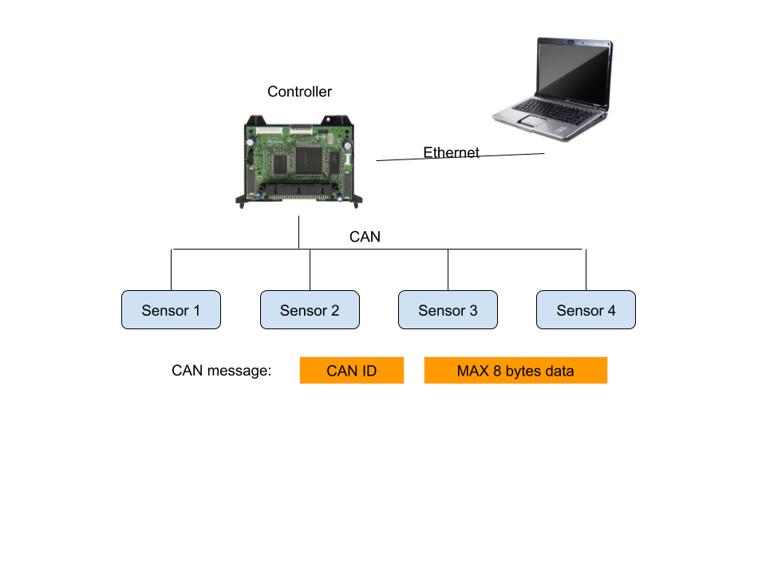

# Build CLI with cmd2

Youngmin Kim

---

## What is Command Line Interface (CLI) application

* Interact with computer entirely through your terminal by commands

* CLI types
  - (O) Command-line utilities (CLU)
  - (O) **Interactive Command Line Interface**

* (X) Text User Interface (TUI)

--

### <code>Command-line utilities (CLU)</code>
- Accept arguments at invocation, execute, and terminate
- Examples:  ``ls``, ``grep``, ``ping``
- Python’s built-in **argparse** module has covered this well

--

### <code> Interactive CLI </code>
- Multiple interactions
  * read–eval–print **loop** (REPL)
- Examples: ``bash``, ``ipython``  

--

### <code>Text User Interfaces (TUI)</code>
- Full-screen applications more like a GUI but in a terminal
- Examples:  ``vim``, ``emacs``, ``top``

---

## <code>Motivation for building a CLI</code>
- Advantages of a CLI over a GUI
- Advantages of a CLI over a CLU

--

### <code>Advantages of a CLI over a GUI</code>
- Easier and faster to write
- Scriptable
- Easily interact with standard CLU tools
- Can be executed over a remote non-graphical connection such as **ssh**

--

--

### <code>Advantages of a CLI over a CLU</code>
- Ability to be interactive
- And keep **state** between commands

---

## What is cmd?

* Built-in python module to make interactive CLI
* It supports
  - to process commands
  - command autocompletion
  - help statements

---

## What is cmd2?

- Extends Python’s built-in cmd module

* It supports
  - all the functions from cmd
  - exception handling
  - better argument parsing / tab completion
  - history / persistent history

---

## Case Study

* Run famous CLUs or small-size your own scripts through cmd2
  - e.g., conda / virtualenv
  - Restful API

* Apply CLI to CANopen network
  - CLI itself
  - pytest through ssh

--

--

### something useful

* Print output in realtime
  - local command 
  - ssh command (paramiko)

---

# Thank you!
